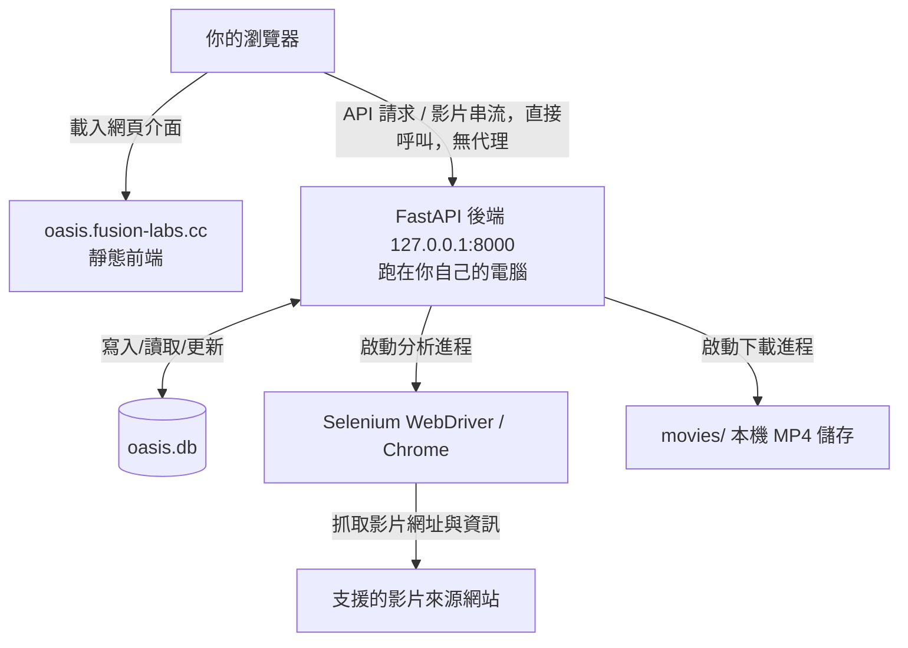

# 🛠️ Oasis 開發與技術文件

這份文件給想修改程式碼、新增站台 adapter，或想了解系統怎麼運作的人。一般使用者只要看 [README.md](./README.md) 就夠了。

---

## 🏗️ 系統架構 (Architecture)

Oasis **不是一個代管網站**——`oasis.fusion-labs.cc` 只是一個靜態部署的前端，瀏覽器會直接呼叫你自己電腦上跑的後端，中間沒有任何伺服器轉手你的資料。



---

## 🔄 軟體更新機制

兩個版本號，各自放在不同地方是刻意設計：

- **`VERSION`**（git tag）放在 **app payload 裡** (`app/VERSION`)：它標記的是程式碼本身，而更新替換的正是程式碼。原始碼直接執行沒有這個檔案，回報為 `"dev"` 並視為「永遠不落後」，不會被提示更新。
- **`RUNTIME`** 放在 **`_internal/` 裡**：指紋化「這支執行檔實際凍結了什麼」（Python 版本、`requirements.txt`、`run_backend.py`），只有真的需要重新編譯 `.exe` 時才會變。

`updater.py`（只在打包版存在）依 release 的 `RUNTIME` 是否等於目前執行的 `RUNTIME`，走兩條路之一：

- **Light（幾乎都是這條）**：`RUNTIME` 相同 ⇒ 新程式碼可以直接跑在現有的 `.exe` 上。下載 `oasis-backend-patch.zip`（約 35 KB），放進 `.oasis-update/pending-app` 暫存，重新啟動自己；新程序在 import 任何東西**之前**先把 `app/` 換掉。沒有任何檔案是 OS 鎖住的，所以不需要 helper script、也沒有 rollback 要處理。
- **Full（只有 `RUNTIME` 不同時）**：下載對應 OS 的完整 zip，交給一支獨立的 OS 原生 helper（sh / PowerShell）：先關閉這支後端，抽換每個頂層項目，再重啟。這條路存在的唯一原因是**跑著的程序沒辦法覆寫自己的執行檔或已載入的函式庫**——所以才需要「先搬到旁邊、裝好了再回滾」這套動作；也是為什麼 helper 不能用 `DETACHED_PROCESS` 產生（PowerShell 會秒退，要用 `CREATE_NO_WINDOW`）。

Light 更新失敗不會動到硬碟上任何東西，會自動退回走 Full；Full 更新失敗會 rollback 並重啟舊版本。`oasis.db`、`movies/`、`sites/` 都在兩種更新包之外，永遠保留。整個更新過程橫跨多個程序，每一步都寫進 `.oasis-update/`（沒有任何更新包會動這個資料夾），`/api/update/logs` 讀的就是這裡——這是更新失敗時唯一能查的地方。

發版是 `git tag v0.1.0 && git push origin v0.1.0`；CI 會發布兩個完整安裝包，加上 Light 更新用的 `oasis-backend-patch.zip`。

---

## 🧩 站台 Adapter 設定 (Site Adapters)

本工具是一個**通用的網頁讀取／下載引擎，本身不內建任何特定網站的定義**——README 提到的三個支援網站（Jable、MissAV、SupJav）也只是三份 JSON 設定檔。要讓解析或下載支援新的網站，需自行提供一份該網站的「adapter」設定檔：

1. 參考 `backend/sites.example.json`，它記錄了 adapter 的完整格式（網域比對規則、標題／標籤的 CSS 選擇器、m3u8 擷取方式、必要的 HTTP 標頭等）。
2. 複製一份到 `backend/sites/<你的站台>.json` 並填入對應設定。
3. `backend/sites/` 已內含數個 adapter，你可以直接增修，或依相同格式新增自己的；它們會隨更新一併更新。

引擎會在啟動時載入 `backend/sites/` 下的所有 adapter；未設定任何 adapter 時，解析功能自然不會對任何網站生效（但仍可用 README 提到的「手動新增」收藏）。

如何取得某網站的選擇器與 m3u8 擷取方式，是使用者自身的責任；請確保你對該網站的存取與內容使用符合其服務條款與所在地法律。

---

## ⚙️ 進階配置與參數 (Advanced Configuration)

### 後端 API 服務 (Backend FastAPI)
如果要在本機或區域網路單獨託管後端：
- 可以使用 `--backend-only` 參數啟動（不啟用 Next.js 前端）：
  ```bash
  ./oasis-portal.sh --backend-only
  ```
- 環境變數 `ALLOWED_ORIGINS` 可設定 CORS 網域限制。預設為 `http://localhost:3000` 以及部署的網站。

### 前端環境變數 (Frontend Next.js)
在 `web/` 目錄中，可以建立 `.env.local` 檔案來自訂變數：
- `NEXT_PUBLIC_BACKEND_URL`: 指向 FastAPI 後端的 URL（預設為 `http://localhost:8000`）。

---

## 📂 專案目錄結構 (Project Structure)

```
oasis/
├── backend/                  # Python FastAPI 後端服務
│   ├── api.py                # REST API 路由與進程管理
│   ├── crawler.py            # TS 分段下載核心邏輯
│   ├── download.py           # Selenium + m3u8 分析及下載流程
│   ├── encode.py             # FFmpeg 轉檔模組
│   ├── catalog.py            # 元數據刮削與 SQLite 資料庫操作
│   ├── requirements.txt      # Python 套件依賴清單
│   ├── site_config.py        # 通用站台 adapter 引擎（不含任何內建站台定義）
│   ├── sites.example.json    # 站台 adapter 範本（記錄設定格式）
│   └── sites/                # 站台 adapter（JSON）；可依 sites.example.json 增修
├── web/                      # Next.js 前端 App (TypeScript + Tailwind)
│   ├── src/
│   │   ├── app/               # Next.js App Router 頁面
│   │   ├── components/        # 可複用 UI 元件 (如新增影片 Modal)
│   │   └── lib/               # API 封裝
│   └── wrangler.jsonc        # Cloudflare Workers / Pages 部署設定
├── movies/                   # 本機 MP4 影音儲存路徑 (Git 忽略)
├── oasis/                    # Python 虛擬環境 (Git 忽略)
├── oasis-portal.sh           # macOS / Linux 啟動指令檔
├── oasis-portal.ps1          # Windows PowerShell 啟動指令檔
└── oasis-portal.bat          # Windows Bat 啟動入口
```

---

## 👨‍💻 開發說明 (Development)

- **手動開啟後端**:
  ```bash
  ./oasis/bin/python -m uvicorn api:app --app-dir backend --reload --port 8000
  ```
- **手動開啟前端**:
  ```bash
  cd web
  npm run dev
  ```
- **資料庫管理**:
  若要查看或編輯影片元數據，可以直接使用 SQLite 客戶端打開 `backend/oasis.db`。
