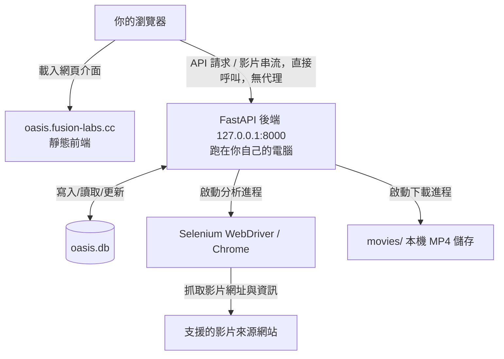

# 🎬 Oasis (綠洲) - 個人謎片管理中心

<p align="center">
  <a href="https://github.com/fusion-labs-cc/oasis/releases/latest"></a>
  <a href="https://github.com/fusion-labs-cc/oasis/releases"></a>
  <a href="./LICENSE"></a>
</p>

Oasis 是一個**你自己架、自己用**的個人謎片收藏中心與下載器：網頁介面是公開部署的 [oasis.fusion-labs.cc](https://oasis.fusion-labs.cc)，但實際的爬蟲、下載與資料庫都跑在**你自己的電腦上**——你的謎片清單、下載紀錄都留在你自己的硬碟裡，不會經過任何人的伺服器。

支援從多個謎片網站解析與下載（並持續擴充支援的網站），結合 Python 爬蟲後端與 Next.js 網頁前端，提供網址解析、自動翻譯、下載、手動新增、標籤與演員分類管理，到串流或本機播放器播放的一站式體驗。

> ⚠️ **內容性質**：本工具內建的站台 adapter 針對的是**成人謎片網站**（見下方〈支援的網站〉）。請確認你已達所在地區法定成年年齡，且下載、觀看該類內容合法，再使用本工具。

---

## 🧭 先選你的使用方式

不確定要選哪個？**先選第二種**——不用裝任何開發工具，最快能看到成果。

| 情境 | 建議 | 需要安裝 |
|---|---|---|
| 只想連 [oasis.fusion-labs.cc](https://oasis.fusion-labs.cc)，下載動作在自己電腦上跑（Windows / macOS 皆可） | 下載打包好的 `oasis-backend` | 不需要 git / Node.js / Python |
| 想要完整體驗、之後也想自己改程式碼 | `git clone` + 一鍵啟動腳本 | Python、Node.js（腳本會引導安裝） |

---

## 🚀 開始使用

### 方式一：只要後端，前端用公開網站

不需要 git、Node.js 或 Python：到 [Releases](../../releases) 下載對應作業系統的 `oasis-backend-*.zip`，解壓縮後：

- **Windows**：雙擊 `oasis-backend.exe`。
- **macOS**：`oasis-backend` 沒有簽章，第一次執行前需要手動解除隔離標記，否則雙擊會被 Gatekeeper 擋下（顯示「無法確認開發者」）：
  1. 在 Finder 解壓縮後的資料夾內，滑鼠右鍵點空白處 →「服務」→「於資料夾建立終端機頁籤」（沒有這個選項的話，把資料夾直接拖到 Dock 上的「終端機」圖示也能在該路徑開啟終端機）。
  2. 在跳出的終端機視窗輸入：`xattr -cr .` 並按 Enter（只需執行一次）。
  3. 之後雙擊 `oasis-backend.command` 啟動後端（直接雙擊 `oasis-backend` 也能用，只是少了 Chrome 偵測提示）。

後端啟動後，直接開啟 **[oasis.fusion-labs.cc](https://oasis.fusion-labs.cc)** 即可，它會自動連到你電腦上 `http://localhost:8000` 的後端。你的影片、資料庫都存在解壓縮出來的這個資料夾裡。

### 方式二：完整原始碼（前端＋後端一起跑在你的電腦）

**macOS & Linux**：

```bash
chmod +x oasis-portal.sh
./oasis-portal.sh
```

**Windows**：建議直接雙擊執行 `oasis-portal.bat` —— 它會自動以 PowerShell 啟動整個流程，無需額外設定。

> 💡 直接雙擊 `.ps1` 檔預設只會用記事本開啟（除非你已將 `.ps1` 的預設程式設為 PowerShell）。若偏好手動在 PowerShell 中執行：`./oasis-portal.ps1`

啟動腳本會自動完成：

1. 檢測並引導安裝 Python、Node.js、FFmpeg、Google Chrome 等系統組件。
2. 在 `oasis/` 目錄建立 Python 虛擬環境並安裝 backend 依賴。
3. 自動安裝 frontend npm 依賴套件。
4. 初始化資料庫並建立 `movies/` 儲存資料夾。
5. 啟動並預載 FastAPI 後端服務（Port 8000）。
6. 啟動 Next.js 開發伺服器（Port 3000）並自動開啟瀏覽器。

只想跑後端（例如你想自己架設給區網其他裝置連）可加參數：`./oasis-portal.sh --backend-only`。

---

## ✨ 核心特色 (Key Features)

- 🎨 **現代化網頁介面**：基於 Next.js 與 Tailwind CSS 打造的暗黑風格儀表板，支援響應式佈局。
- 🔍 **智慧元數據爬取**：輸入影片網址後，後端透過 Selenium Headless Chrome 自動提取番號、演員、標籤與封面，並自動將日文標題翻譯為繁體中文。
- 📂 **在地化資料庫管理**：所有解析或下載的影片皆儲存於本機 SQLite 資料庫 (`oasis.db`)，方便隨時檢索。
- ⚡ **序列化下載佇列與即時進度**：獨立 OS 進程下載，不阻塞 Web 伺服器；佇列逐一執行並即時顯示進度；自動處理 m3u8 播放清單、TS 分段下載、合成 MP4 與轉檔。
- 🔁 **重啟續存**：下載佇列與進度會持久化，即使後端服務重啟也能還原未完成的工作，不必從頭來過。
- 🎬 **靈活的播放方案**：內建 Plyr 播放器線上串流，或一鍵呼叫電腦預設播放器（VLC、IINA、PotPlayer 等）並自動記錄播放次數與進度。
- 🎲 **隨機挑片**：一鍵從已下載的影片中隨機跳轉到一部。
- ☑️ **多選批次操作**：在卡片上多選，一次批次匯出或刪除多部影片。
- 🔄 **JSON 匯入 / 匯出**：整份收藏庫或所選影片可匯出與匯入，方便備份與遷移。
- ✍️ **手動新增**：沒有 adapter 的網站也能收藏——自己填標題、番號、演員、標籤即可，不需要自動解析。
- 🕶️ **Awake Mode（老闆鍵偽裝）**：`⌘+X`（macOS）/ `Alt+X`（Windows 等）一鍵將整個網站偽裝成 Google 首頁，狀態跨重新整理與分頁重開持久化保留。
- 🛠️ **一鍵啟動與環境建置**：跨平台整合啟動腳本，自動安裝依賴、建立虛擬環境並同時啟動前後端。

---

## 🏗️ 系統架構 (Architecture)

Oasis **不是一個代管網站**——`oasis.fusion-labs.cc` 只是一個靜態部署的前端，瀏覽器會直接呼叫你自己電腦上跑的後端，中間沒有任何伺服器轉手你的資料。



---

## 📦 系統需求 (System Requirements)

若走「方式一：只要後端」，打包好的 `.exe` / `.command` 已內含所有需要的東西，不需要另外安裝。

若走「方式二：完整原始碼」，請確保系統已安裝：

- **Python 3.10+**（用於運行 FastAPI 後端與爬蟲下載器）
- **Node.js 18+** & **npm**（用於運行 Next.js 前端）
- **FFmpeg**（用於影音片段合併與轉檔）
- **Google Chrome** / **Chromium**（Selenium 解析網頁所需）

> 💡 **自動安裝支援**：啟動腳本（macOS/Linux: `oasis-portal.sh`，Windows: `oasis-portal.ps1`）在偵測到缺失 `FFmpeg` 或 `Chrome` 時，會嘗試透過系統套件管理器（如 `apt-get`、`brew`、`winget`）進行自動安裝。

---

## 🔄 軟體更新 (Updating)

Oasis 有兩種更新方式，依你的安裝來源自動採用：

- **原始碼版（`git clone` + 啟動腳本）**：每次啟動時會自動 `git pull --ff-only` 拉取最新程式碼，無需手動操作（離線時會略過並沿用本機版本）。
- **打包版（GitHub Releases 的 zip）**：到 **設定頁 → 關於與更新** 按「檢查更新」；若有新版本，按 **「立即更新」** 即可一鍵完成：
  1. 後端下載對應你作業系統的最新 Release
  2. 一支獨立的 helper 程序在後端關閉後就地抽換程式檔案
  3. 後端自行重新啟動，網頁前端會自動重新連線

  你的資料庫（`oasis.db`）與影片（`movies/`）不在更新包內，會**完整保留**。更新期間請避免有下載工作正在進行，以免檔案被占用。若一鍵更新失敗，仍可透過同區塊的「或手動下載」連結取得 zip，解壓縮覆蓋原資料夾即可。

> 版本號來自 CI 建置時寫入的 `VERSION` 檔（發行的 git tag）；原始碼直接執行時會顯示為 `dev`，並被視為「永遠不落後」，因此不會被提示更新。

---

## 🌐 支援的網站 (Supported Sites)

| 網站 | 網域 | 自動解析／下載 |
|---|---|---|
| [Jable](https://jable.tv) | `jable.tv` | ✅ |
| [MissAV](https://missav.ws) | `missav.*` | ✅ |
| [SupJav](https://supjav.com) | `supjav.*` | ✅ |

這三個是隨版本內建的 adapter（`backend/sites/*.json`），可以直接貼網址自動解析番號、演員、標籤、封面並下載。

**其他網站也能收藏，只是不會自動解析／下載。** 在網頁介面按「新增影片」→「手動新增」，自己填標題、番號、演員、標籤與封面圖，就能把任何網址記錄進收藏庫；要幫該網站做到跟上面三個一樣的自動解析／下載，就需要自己寫一份 adapter（見下方）。

---

## 🧩 站台 Adapter 設定 (Site Adapters)

本工具是一個**通用的網頁讀取／下載引擎，本身不內建任何特定網站的定義**——上面三個支援的網站也只是三份 JSON 設定檔。要讓解析或下載支援新的網站，需自行提供一份該網站的「adapter」設定檔：

1. 參考 `backend/sites.example.json`，它記錄了 adapter 的完整格式（網域比對規則、標題／標籤的 CSS 選擇器、m3u8 擷取方式、必要的 HTTP 標頭等）。
2. 複製一份到 `backend/sites/<你的站台>.json` 並填入對應設定。
3. `backend/sites/` 已內含數個 adapter，你可以直接增修，或依相同格式新增自己的；它們會隨更新一併更新。

引擎會在啟動時載入 `backend/sites/` 下的所有 adapter；未設定任何 adapter 時，解析功能自然不會對任何網站生效（但仍可用上面提到的「手動新增」收藏）。

如何取得某網站的選擇器與 m3u8 擷取方式，是使用者自身的責任；請確保你對該網站的存取與內容使用符合其服務條款與所在地法律。

---

## ⚙️ 進階配置與參數 (Advanced Configuration)

### 後端 API 服務 (Backend FastAPI)
如果要在本機或區域網路單獨託管後端：
- 可以使用 `--backend-only` 參數啟動（不啟用 Next.js 前端）：
  ```bash
  ./oasis-portal.sh --backend-only
  ```
- 環境變數 `ALLOWED_ORIGINS` 可設定 CORS 網域限制。預設為 `http://localhost:3000` 以及部署的網站。

### 前端環境變數 (Frontend Next.js)
在 `web/` 目錄中，可以建立 `.env.local` 檔案來自訂變數：
- `NEXT_PUBLIC_BACKEND_URL`: 指向 FastAPI 後端的 URL（預設為 `http://localhost:8000`）。

---

## 📂 專案目錄結構 (Project Structure)

```
oasis/
├── backend/                  # Python FastAPI 後端服務
│   ├── api.py                # REST API 路由與進程管理
│   ├── crawler.py            # TS 分段下載核心邏輯
│   ├── download.py           # Selenium + m3u8 分析及下載流程
│   ├── encode.py             # FFmpeg 轉檔模組
│   ├── catalog.py            # 元數據刮削與 SQLite 資料庫操作
│   ├── requirements.txt      # Python 套件依賴清單
│   ├── site_config.py        # 通用站台 adapter 引擎（不含任何內建站台定義）
│   ├── sites.example.json    # 站台 adapter 範本（記錄設定格式）
│   └── sites/                # 站台 adapter（JSON）；可依 sites.example.json 增修
├── web/                      # Next.js 前端 App (TypeScript + Tailwind)
│   ├── src/
│   │   ├── app/               # Next.js App Router 頁面
│   │   ├── components/        # 可複用 UI 元件 (如新增影片 Modal)
│   │   └── lib/               # API 封裝
│   └── wrangler.jsonc        # Cloudflare Workers / Pages 部署設定
├── movies/                   # 本機 MP4 影音儲存路徑 (Git 忽略)
├── oasis/                    # Python 虛擬環境 (Git 忽略)
├── oasis-portal.sh           # macOS / Linux 啟動指令檔
├── oasis-portal.ps1          # Windows PowerShell 啟動指令檔
└── oasis-portal.bat          # Windows Bat 啟動入口
```

---

## 🛠️ 開發說明 (Development)

- **手動開啟後端**:
  ```bash
  ./oasis/bin/python -m uvicorn api:app --app-dir backend --reload --port 8000
  ```
- **手動開啟前端**:
  ```bash
  cd web
  npm run dev
  ```
- **資料庫管理**:
  若要查看或編輯影片元數據，可以直接使用 SQLite 客戶端打開 `backend/oasis.db`。

---

## 🙋 遇到問題 (Troubleshooting)

開 [GitHub Issue](https://github.com/fusion-labs-cc/oasis/issues/new) 之前，請先確認自己是用最新版本；回報時請附上：

- 你用的方式（打包後端 / 原始碼）、作業系統、版本號（設定頁「關於與更新」可查）。
- 觸發問題的操作步驟，以及預期結果 vs. 實際結果。
- 若後端主控台視窗有印出錯誤訊息，直接複製貼上。

⚠️ **請不要**附上你的存取碼、`oasis.db`、`oasis.auth.json` 或其他包含個資／連結的檔案內容。

---

## ⚠️ 免責聲明 (Disclaimer)

本工具內建的站台 adapter（Jable、MissAV、SupJav）皆為**成人影片（A 片）網站**，僅供已達所在地區法定成年年齡、且該地區法律允許之使用者使用。除此之外，本工具是通用的個人影音管理引擎，不內建其他任何特定網站的定義；使用者自行新增的站台 adapter 由使用者自己提供與維護。

使用者須自負其設定與使用行為，並遵守目標網站的服務條款與當地法律。

本專案依 [LICENSE](./LICENSE) 授權；第三方元件授權見 [THIRD-PARTY-LICENSES.txt](./THIRD-PARTY-LICENSES.txt)。
