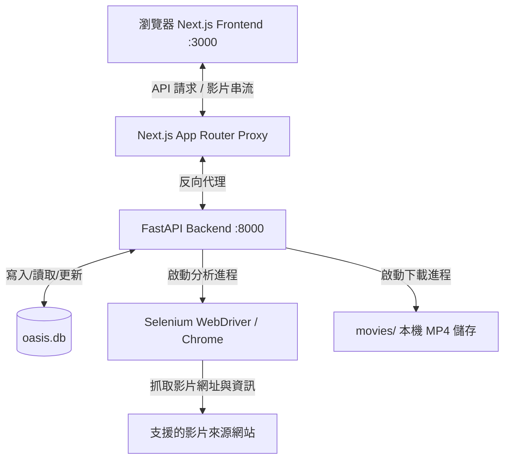

# 🎬 Oasis (綠洲) - 個人影音管理中心

Oasis 是一個個人私人影音收藏中心與下載器，支援從多個影片網站解析與下載（並持續擴充支援的網站）。它結合了強大的 Python 爬蟲後端與現代化的 Next.js 網頁前端，提供從網址解析、自動翻譯、影片下載、手動新增、標籤與演員分類管理，到網頁串流播放或本機直接播放的一站式體驗。

---

## ✨ 核心特色 (Key Features)

- 🎨 **現代化網頁介面 (Modern Web UI)**: 基於 Next.js 與 Tailwind CSS 打造的精美暗黑風格儀表板，支援響應式佈局與順暢的互動體驗。
- 🔍 **智慧元數據爬取 (Smart Metadata Scraping)**: 輸入影片網址後，後端透過 Selenium Headless Chrome 自動提取番號、演員、標籤與封面，並自動將日文標題翻譯為繁體中文（Google Translator 整合）。
- 📂 **在地化資料庫管理 (Local SQLite Catalog)**: 所有解析或下載的影片皆儲存於本機 SQLite 資料庫 (`oasis.db`)，方便隨時檢索。
- ⚡ **序列化下載佇列與即時進度 (Serial Download Queue & Live Progress)**: 採用獨立的 OS 進程進行下載，不阻塞 Web 伺服器。下載工作會依序排入佇列逐一執行，並在整個介面同步顯示即時進度；自動處理 m3u8 播放清單與 TS 分段的下載、合成為 MP4，並完成無損轉檔或硬體加速轉檔。
- 🔁 **重啟續存 (Restart Resilience)**: 下載佇列與進度會持久化，即使後端服務重啟也能還原未完成的工作與狀態，不必從頭來過。
- 🎬 **靈活的播放方案 (Flexible Playback)**:
  - **瀏覽器串流播放**: 內建 Plyr 播放器，直接線上串流觀看下載完的影片。
  - **本機外部播放器開啟**: 支援一鍵呼叫電腦預設播放器（如 VLC、IINA、PotPlayer 等）進行流暢播放，並自動記錄播放次數與進度。
- 🎲 **隨機挑片 (Random Pick)**: 一鍵從已下載的影片中隨機跳轉到一部，快速決定要看什麼。
- ☑️ **多選批次操作 (Multi-select Bulk Actions)**: 在卡片上進行多選，一次批次匯出或刪除多部影片。
- 🔄 **JSON 匯入 / 匯出 (JSON Import / Export)**: 支援將整份收藏庫或所選影片以 JSON 格式匯出與匯入，方便備份與遷移。
- 🕶️ **Awake Mode（老闆鍵偽裝）**: 以 `⌘+X`（macOS）/ `Alt+X`（Windows 等）快捷鍵一鍵將整個網站偽裝成 Google 首頁，並同步替換分頁標題與 favicon；狀態會跨重新整理與分頁重開持久化保留。
- 🛠️ **一鍵啟動與環境建置 (One-Click Bootstrap)**: 提供跨平台整合啟動腳本（`oasis-portal.sh` & `oasis-portal.ps1`），自動安裝依賴、建立虛擬環境、準備目錄並同時啟動前端與後端服務。

---

## 🏗️ 系統架構 (Architecture)



---

## 📦 系統需求 (System Requirements)

在執行 Oasis 之前，請確保您的系統已安裝以下工具：

- **Python 3.10+** (用於運行 FastAPI 後端與爬蟲下載器)
- **Node.js 18+** & **npm** (用於運行 Next.js 前端)
- **FFmpeg** (用於影音片段合併與轉檔)
- **Google Chrome** / **Chromium** (Selenium 解析網頁所需)

> 💡 **自動安裝支援**：本專案的啟動腳本（macOS/Linux: `oasis-portal.sh`，Windows: `oasis-portal.ps1`）在偵測到缺失 `FFmpeg` 或 `Chrome` 時，會嘗試透過系統套件管理器（如 `apt-get`、`brew`、`winget`）進行自動安裝。

---

## 🚀 快速開始 (Getting Started)

### 💻 macOS & Linux 使用者

請直接在終端機中執行：

```bash
chmod +x oasis-portal.sh
./oasis-portal.sh
```

### 🪟 Windows 使用者

**建議直接雙擊執行 `oasis-portal.bat`** —— 它會自動以 PowerShell 啟動整個流程，無需額外設定。

> 💡 直接雙擊 `.ps1` 檔預設只會用記事本開啟（除非您已將 `.ps1` 的預設程式設為 PowerShell）。若您偏好手動在 PowerShell 中執行，可使用：
> ```powershell
> ./oasis-portal.ps1
> ```

### 🔍 啟動腳本會自動完成：
1. 檢測並引導安裝 Python, Node.js, FFmpeg, Google Chrome 等系統組件。
2. 在 `oasis/` 目錄建立 Python 虛擬環境並安裝 backend 依賴。
3. 自動安裝 frontend npm 依賴套件。
4. 初始化資料庫並建立 `movies/` 儲存資料夾。
5. 啟動並預載 FastAPI 後端服務（Port 8000）。
6. 啟動 Next.js 開發伺服器（Port 3000）並自動開啟瀏覽器。

---

## 🔄 軟體更新 (Updating)

Oasis 有兩種更新方式，依你的安裝來源自動採用：

- **原始碼版（`git clone` + 啟動腳本）**：`oasis-portal.sh` / `oasis-portal.ps1` 每次啟動時會自動 `git pull --ff-only` 拉取最新程式碼，無需手動操作（離線時會略過並沿用本機版本）。
- **打包版（GitHub Releases 的 zip）**：到 **設定頁 → 關於與更新** 按「檢查更新」；若有新版本，按 **「立即更新」** 即可一鍵完成：
  1. 後端下載對應你作業系統的最新 Release
  2. 一支獨立的 helper 程序在後端關閉後就地抽換程式檔案
  3. 後端自行重新啟動，網頁前端會自動重新連線

  你的資料庫（`oasis.db`）與影片（`movies/`）不在更新包內，會**完整保留**。更新期間請避免有下載工作正在進行，以免檔案被占用。若一鍵更新失敗，仍可透過同區塊的「或手動下載」連結取得 zip，解壓縮覆蓋原資料夾即可。

> 版本號來自 CI 建置時寫入的 `VERSION` 檔（發行的 git tag）；原始碼直接執行時會顯示為 `dev`，並被視為「永遠不落後」，因此不會被提示更新。

---

## 🧩 站台 Adapter 設定 (Site Adapters)

本工具是一個**通用的網頁讀取／下載引擎，本身不內建任何特定網站的定義**。要解析或下載某個網站，需由使用者自行提供一份該網站的「adapter」設定檔：

1. 參考 `backend/sites.example.json`，它記錄了 adapter 的完整格式（網域比對規則、標題／標籤的 CSS 選擇器、m3u8 擷取方式、必要的 HTTP 標頭等）。
2. 複製一份到 `backend/sites/<你的站台>.json` 並填入對應設定。
3. `backend/sites/` 已內含數個 adapter，你可以直接增修，或依相同格式新增自己的；它們會隨 `git pull` 一併更新。

引擎會在啟動時載入 `backend/sites/` 下的所有 adapter；未設定任何 adapter 時，解析功能自然不會對任何網站生效。

如何取得某網站的選擇器與 m3u8 擷取方式，是使用者自身的責任；請確保你對該網站的存取與內容使用符合其服務條款與所在地法律。

---

## ⚙️ 進階配置與參數 (Advanced Configuration)

### 後端 API 服務 (Backend FastAPI)
如果要在本機或區域網路單獨託管後端：
- 可以使用 `--backend-only` 參數啟動（不啟用 Next.js 前端）：
  ```bash
  ./oasis-portal.sh --backend-only
  ```
- 環境變數 `ALLOWED_ORIGINS` 可設定 CORS 網域限制。預設為 `http://localhost:3000` 以及部署的 Vercel/Cloudflare Workers 站點。

### 前端環境變數 (Frontend Next.js)
在 `web/` 目錄中，可以建立 `.env.local` 檔案來自訂變數：
- `NEXT_PUBLIC_BACKEND_URL`: 指向 FastAPI 後端的 URL（預設為 `http://localhost:8000`）。

---

## 📂 專案目錄結構 (Project Structure)

```
oasis/
├── backend/                  # Python FastAPI 後端服務
│   ├── api.py                # REST API 路由與進程管理
│   ├── crawler.py            # TS 分段下載核心邏輯
│   ├── download.py           # Selenium + m3u8 分析及下載流程
│   ├── encode.py             # FFmpeg 轉檔模組
│   ├── catalog.py            # 元數據刮削與 SQLite 資料庫操作
│   ├── requirements.txt      # Python 套件依賴清單
│   ├── site_config.py        # 通用站台 adapter 引擎（不含任何內建站台定義）
│   ├── sites.example.json    # 站台 adapter 範本（記錄設定格式）
│   └── sites/                # 站台 adapter（JSON）；可依 sites.example.json 增修
├── web/                      # Next.js 前端 App (TypeScript + Tailwind)
│   ├── src/
│   │   ├── app/              # Next.js App Router 頁面
│   │   ├── components/       # 可複用 UI 元件 (如新增影片 Modal)
│   │   └── lib/              # API 封裝
│   └── wrangler.jsonc        # Cloudflare Workers / Pages 部署設定
├── movies/                   # 本機 MP4 影音儲存路徑 (Git 忽略)
├── oasis/                    # Python 虛擬環境 (Git 忽略)
├── oasis-portal.sh           # macOS / Linux 啟動指令檔
├── oasis-portal.ps1          # Windows PowerShell 啟動指令檔
└── oasis-portal.bat          # Windows Bat 啟動入口
```

---

## 🛠️ 開發說明 (Development)

- **手動開啟後端**:
  ```bash
  ./oasis/bin/python -m uvicorn api:app --app-dir backend --reload --port 8000
  ```
- **手動開啟前端**:
  ```bash
  cd web
  npm run dev
  ```
- **資料庫管理**:
  若要查看或編輯影片元數據，可以直接使用 SQLite 客戶端打開 `backend/oasis.db`。

---

## ⚠️ 免責聲明 (Disclaimer)

通用的個人影音管理工具，不內建任何特定網站的定義；站台 adapter 由使用者自行提供。使用者須自負其設定與使用行為，並遵守目標網站的服務條款與當地法律。

本專案依 [LICENSE](./LICENSE) 授權；第三方元件授權見 [THIRD-PARTY-LICENSES.txt](./THIRD-PARTY-LICENSES.txt)。
